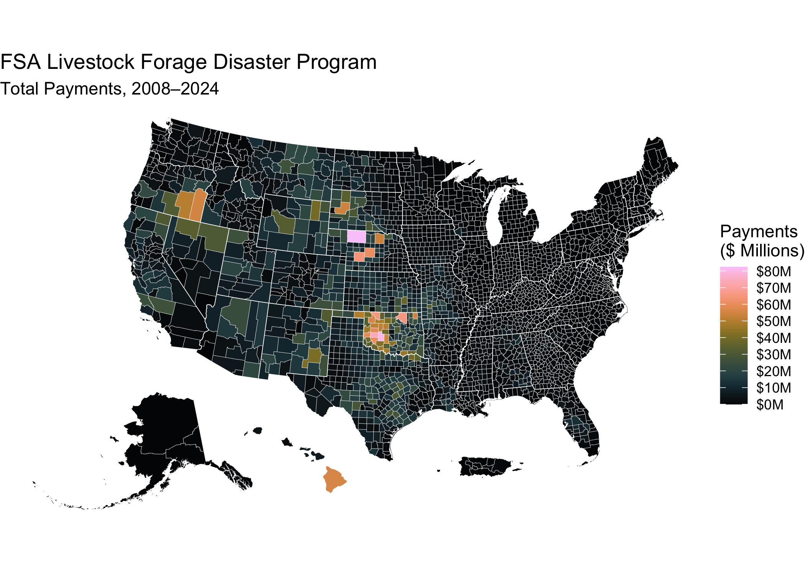

# US Department of Agriculture Farm Service Agency Farm Payment Files, 2004–2024

This repository is an archive of the US Department of Agriculture Farm
Service Agency (FSA) [Farm Payment
Files](https://www.fsa.usda.gov/tools/informational/freedom-information-act-foia/electronic-reading-room/frequently-requested/payment-files).
FSA maintains records on payments made to agricultural program
participants in electronic form. In response to public interest in this
data, FSA makes it available on a public website and via a Freedom of
Information Act (FOIA) request. Data on the website are available as
multiple Microsoft Excel files per year, which are large and tedious to
process. The script in this repository automates the process of
downloading the data and appending them into a single large dataset,
then writing the data as a partitioned Parquet dataset, which
facilitates efficient analysis.

------------------------------------------------------------------------

## 📍 Quick Start: Visualize a Normal Grazing Period Map in R

This snippet shows how to load the Normal Grazing Period file from the
archive and create a simple map using `sf` and `ggplot2`.

``` r
# Load required libraries
library(arrow)
library(sf)
library(ggplot2) # For plotting
library(tigris)  # For state boundaries
library(rmapshaper) # For innerlines function

# Example accessing payment files on S3
# A map of 2024 LFP Payments by county

lfp_payments <-
  # arrow::s3_bucket("climate-smart-usda/fsa-payment-files",
  #                  anonymous = TRUE) %>%
  "fsa-payment-files" |>
  arrow::open_dataset() |>
  dplyr::filter(`Accounting Program Description` %in% 
                  c(
                    "LIVESTOCK FORAGE PROGRAM",
                    "LIVESTOCK FORAGE DISASTER PROGRAM"
                  )) |>
  dplyr::group_by(`FSA Code`) |>
  dplyr::summarise(
    `Disbursement Amount` = sum(`Disbursement Amount`, na.rm = TRUE)
    ) |>
  dplyr::collect()

## The Normal Grazing Period data files use FSA county definitions
## Download from the FSA_Counties_dd17 archive
counties <- 
  sf::read_sf("https://climate-smart-usda.github.io/fsa-counties-dd17/fsa-counties-dd17.topojson",
              layer = "counties") |>
  sf::st_set_crs("EPSG:4326") |>
  sf::st_transform("EPSG:5070")

## Calculate the 2024 Normal Grazing Period duration for Native Pasture, and
## combine with the county data
lfp_payments_counties <-
  lfp_payments |>
  dplyr::select(id = `FSA Code`,
                `Disbursement Amount`) |>
  dplyr::right_join(counties) |>
  sf::st_as_sf() |>
  dplyr::mutate(
    `Disbursement Amount` = 
      tidyr::replace_na(`Disbursement Amount`, 0)
    )
  

# Plot the map
ggplot(counties) +
  geom_sf(data = sf::st_union(counties),
          fill = "grey80",
          color = NA) +
  geom_sf(data = lfp_payments_counties,
          aes(fill = `Disbursement Amount`), 
          color = NA) +
  geom_sf(data = rmapshaper::ms_innerlines(counties),
          fill = NA,
          color = "white",
          linewidth = 0.1) +
  geom_sf(data = counties |>
            dplyr::group_by(state) |>
            dplyr::summarise() |>
            rmapshaper::ms_innerlines(),
          fill = NA,
          color = "white",
          linewidth = 0.2) +
  khroma::scale_fill_batlowK(limits = c(0, NA),
                             breaks = seq(0, 80000000, 10000000),
                             # trans = "log",
                             name = "Payments\n($ Millions)",
                             labels = scales::label_currency(scale = 0.000001, suffix = "M")) +
  labs(title = "FSA Livestock Forage Disaster Program",
       subtitle = "Total Payments, 2008–2024") +
  theme_void()
```



------------------------------------------------------------------------

Data were downloaded from the [FSA Farm Payment Files
website](https://www.fsa.usda.gov/tools/informational/freedom-information-act-foia/electronic-reading-room/frequently-requested/payment-files)
and ingested into the [R statistical
framework](https://www.r-project.org), were cleaned to a common set of
fields, and then were written to a partitioned Parquet dataset available
in the [`fsa-payment-files`](/fsa-payment-files) directory.
[`fsa-payment-files.R`](/fsa-payment-files.R) is the R script that
cleans the data and produces the Parquet dataset. The FSA uses slightly
different county or county equivalent definitions for their service
areas than the standard ANSI FIPS areas used by the US Census.
Geospatial definitions of the FSA counties are included in the
[`FSA_Counties_dd17.gdb.zip`](/FSA_Counties_dd17.gdb.zip) dataset; FSA
county codes are detailed in [FSA Handbook
1-CM](https://www.fsa.usda.gov/Internet/FSA_File/1-cm_r03_a80.pdf),
Exhibit 101. The [`fsa-payment-files`](/fsa-payment-files) directory is
also uploaded to a public Amazon AWS S3 bucket for ease of access.

The [FSA Farm Payment
Files](https://www.fsa.usda.gov/tools/informational/freedom-information-act-foia/electronic-reading-room/frequently-requested/payment-files)
were produced by the USDA Farm Service Agency and are in the Public
Domain. Data in the [`fsa-payment-files`](/fsa-payment-files) directory
were derived from the FSA Farm Payment Files by R. Kyle Bocinsky and are
released under the [Creative Commons CCZero
license](https://creativecommons.org/publicdomain/zero/1.0/). The
[`fsa-payment-files.R`](/fsa-payment-files.R) script is copyright R.
Kyle Bocinsky, and is released under the [MIT License](/LICENSE.md).

This work was supported by grants from the National Oceanic and
Atmospheric Administration, [National Integrated Drought Information
System](https://www.drought.gov) (University Corporation for Atmospheric
Research subaward SUBAWD000858), and by US Department of Agriculture
Office of the Chief Economist (OCE), Office of Energy and Environmental
Policy (OEEP) funds passed through to Research, Education, and Economics
mission area (award 58-3070-3-016).

Please contact Kyle Bocinsky (<kyle.bocinsky@umontana.edu>) with any
questions.

<br>
<p align="center">

<a href="https://climate.umt.edu" target="_blank">

</a>
</p>
